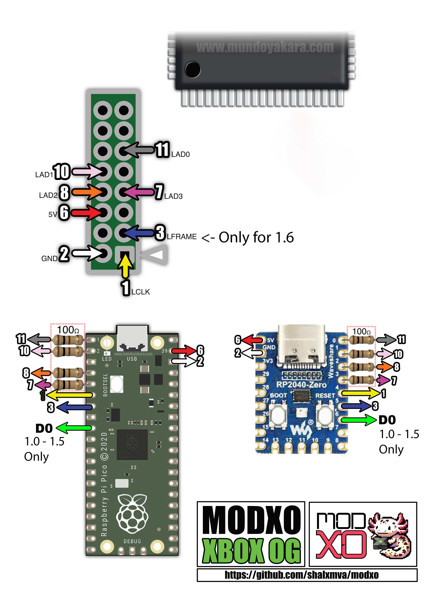

# modxo
Xbox LPC Port modchip using a Raspberry Pi Pico
Modxo is the firmware that makes a Raspberry pi pico into an original Xbox Modchip.

## Planned features
-Implement LFrame cancel to make it compatible without lifting LFrame pin in v1.6

-Implement device communication (specially with LCD)

## Installation requirements
-Working LPC Port
-Original Raspberry Pi Pico or RP2040 Zero (There are some clone boards that are not compatible)
-4 100 Ohm resistors (tested with 1/4 W resistors)

## Wiring diagrams
### Xbox v1.6

