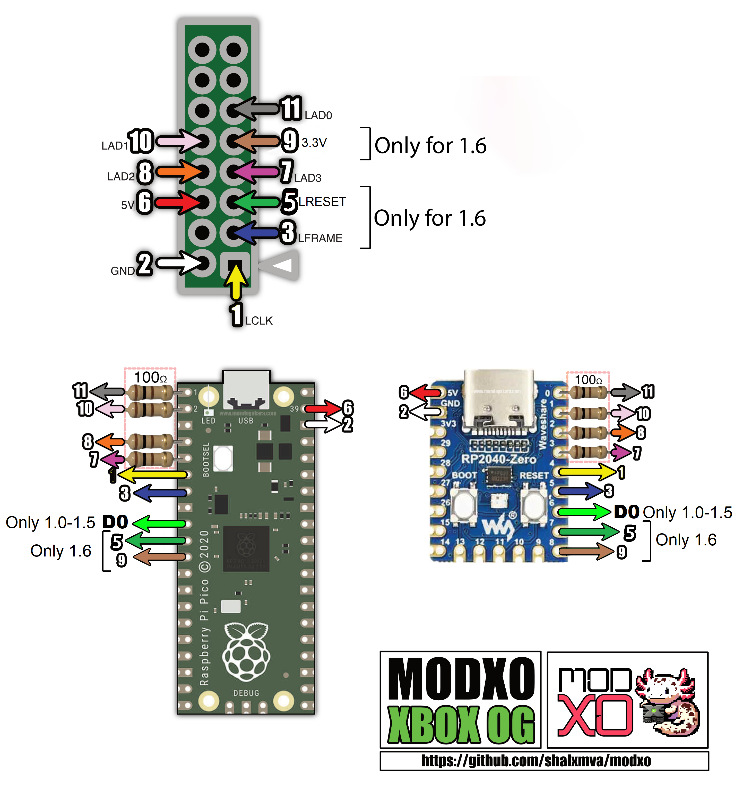

#
Modxo (pronnounced as "Modsho") is a Xbox LPC Port firmware that converts the Raspberry Pi Pico
into an Original Xbox Modchip that allows running a bios.

### Future features
- Implement device communication (specially with LCD)

# How to Install
### 1. Requirements
- Working LPC Port
- Original Raspberry Pi Pico or RP2040 Zero (There are some clone boards that are not compatible)
- 4 100 Ohm resistors (tested with 1/4 W resistors)

### 2. Build Circuit

* Note: D0 is only needed by versions different to 1.6
* Note: LFrame pin connection is only needed by version 1.6. Also LPC Rebuild is Required

### 3. Flashing firmware

#### Packing Bios
1. Go to https://shalxmva.github.io/modxo/
2. Drag and Drop your bios file
3. UF2 File with bios image will be downloaded

##### Paccking Bios locally
1. Copy bios file to `bios.bin` in this directory
2. `docker compose up bios2uf2`
3. output will be `out/bios.uf2`

#### Flashing steps
1. Connect Raspberry Pi Pico with BOOTSEL button pressed to a PC and one new drive will appear.
2. Copy Modxo.uf2 into the Raspberry Pi Pico Drive.
3. Reconnect Raspberry Pi Pico with BOOTSEL button pressed, so the previous drive will showup again.
4. Copy your bios UF2 file into the drive

# Firmware Build Instructions
Todo
#### Windows
Todo
#### Docker
1. `docker compose up builder`
2. output will be `out/modxo.uf2`

# Build firmware and convert Bios Locally with Docker
1. Copy bios file to `bios.bin` in this directory
2. `docker compose up build_all`
3. uf2 files will be in the `out/modxo.uf2` and `out/bios.uf2`
